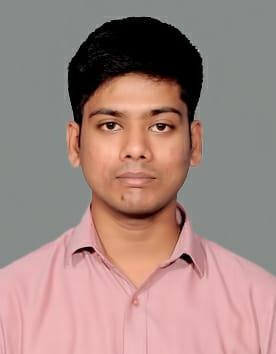

[Home](index.md) | [About](about.md) | [Contact](contact.md) | [Documents](documents.md)

  <!-- Image on left -->
  

  <!-- Text on right -->
  

    <h1>About Me</h1>

    

      Hello! I’m <strong>Ramesh</strong>, a passionate <strong>Technical Writer</strong> with a focus on creating clear, concise, and user-friendly documentation. Currently, I’m working at <strong>Thryve Digital Health LLP</strong> where I specialize in <strong>structured authoring</strong>, <strong>technical documentation</strong>, and <strong>content strategy</strong>.
    

    

      I have a strong interest in making complex technical concepts more accessible to a wider audience. Over the years, I’ve had the opportunity to work with various authoring tools and collaborate with diverse teams, ensuring the best documentation practices are followed.
    

    <h2>My Journey</h2>

    

      I started my career with a keen interest in writing and technology, which led me to explore the world of <strong>technical communication</strong>. After gaining proficiency in authoring tools like <strong>Oxygen XML</strong>, <strong>Confluence</strong>, and <strong>Madcap Flare</strong>, I shifted my focus to creating digital content that not only conveys technical information but is also user-friendly.
    

    

      Today, I focus on helping teams build well-structured and easily understandable documentation that enhances the user experience and drives the success of the product.
    

    <h2>My Skills</h2>

    <ul>
      <li><strong>Authoring Tools</strong>: Oxygen XML, Confluence, Madcap Flare, Microsoft Word</li>
      <li><strong>Technical Skills</strong>: XML, HTML, DITA, Agile Methodologies</li>
      <li><strong>Project Management</strong>: Jira, SharePoint, GitHub</li>
      <li><strong>Visual Editing Tools</strong>: Camtasia, Snagit</li>
      <li><strong>Methodologies</strong>: Structured Authoring, Single Sourcing</li>
    </ul>

    <h2>Why I Love Documentation</h2>

    

      What excites me the most about my profession is the impact it has on making technology accessible to everyone, regardless of their technical expertise. Great documentation is the bridge between complex software products and the end users. My goal is to help users understand, troubleshoot, and make the most out of the products they use.
    

    <h2>Connect with Me</h2>

    

      I am always eager to connect with like-minded professionals and share knowledge. Feel free to reach out if you want to collaborate, discuss tech writing, or simply exchange ideas.
    

    <ul>
      <li>📞 <strong>Phone</strong>: +91-8148955228</li>
      <li>📧 <strong>Email</strong>: <a href="mailto:rameshtm95@gmail.com">rameshtm95@gmail.com</a></li>
      <li>💼 <strong>LinkedIn</strong>: <a href="https://www.linkedin.com/in/ramesh-t-3750a0147/" target="_blank" rel="noopener">Visit my LinkedIn</a></li>
    </ul>

    
Thank you for visiting my page!

  

